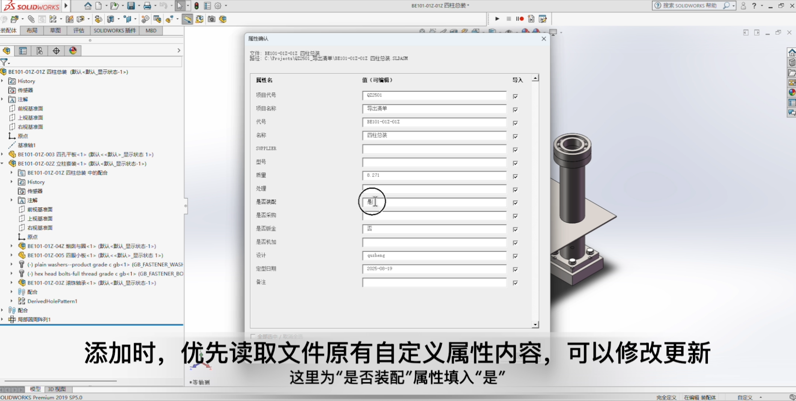
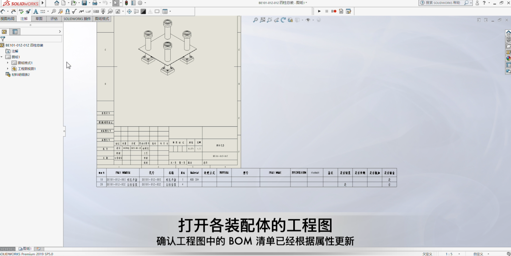
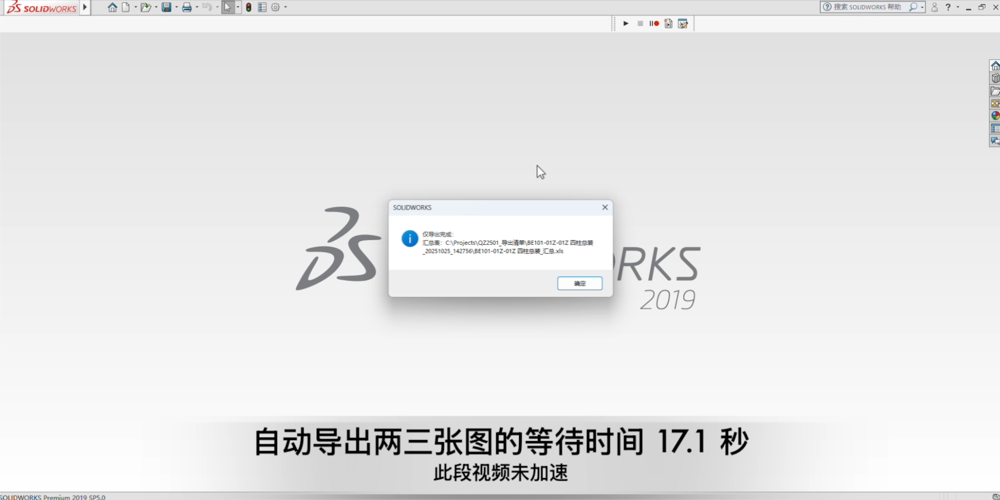
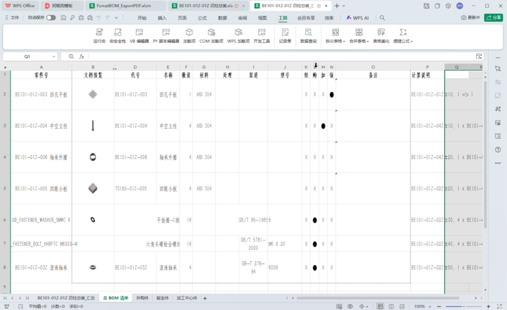
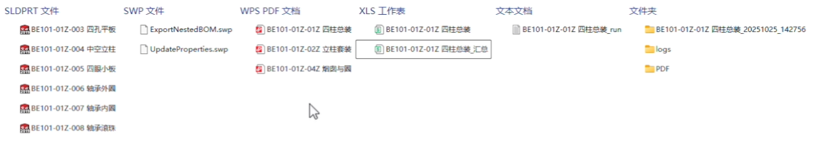

# 用户使用指南

本文面向一线设计/工程人员，介绍如何使用 ExportNestedBOM 在 Excel 中合并与整理从 SolidWorks 导出的子装配 BOM，并生成“总 BOM 清单”、导出 PDF 或分表打印。

适用范围
- 已从 SolidWorks 侧导出各子装配 BOM（或具备现成的 Excel 子装配清单）。
- 目标是把多个子装配清单合并到一个工作簿中，统一格式，生成总 BOM，并按工作表导出 PDF/打印。

系统要求
- Windows 或 macOS，Excel 2016 及以上版本（宏需启用）。
- 支持混合环境：路径拼接已统一使用 Application.PathSeparator，避免“/”与“\”不兼容问题。

快速上手（推荐流程）
1) 合并子装配清单
   - 在 Excel 中打开一个目标工作簿（作为顶层装配容器）。
   - 运行宏：Main.Run_Merge_SubBOMs_Into_CurrentWorkbook
     - 功能：将目标文件夹内的子装配清单合并到当前工作簿；若目标工作簿处于共享状态，会自动解除共享以保证复制成功。

2) 格式化所有可见工作表
   - 运行宏：Main.Run_Format_AllVisibleSheets
   - 功能：统一每张工作表的列标题与列序、布尔列图标化（组/购/加/钣 → 图标）、字体与对齐、打印设置；自动删除“末尾连续的无预览行”；若缺少“备注”列且存在“零件名称”，会自动在其前插入“备注”。

3) 基于“汇总”生成“总 BOM 清单”
   - 在当前工作簿准备好“汇总”工作表（包含关键字段）。
   - 运行宏：Main.Run_Generate_TotalBOM_FromSummary
   - 功能：不再遍历文件夹，而是在当前工作簿中的各子装配工作表里查找匹配项（默认排除“汇总”与“总 BOM 清单”），生成标准的“总 BOM 清单”。

4) 输出
   - 分表导出 PDF：Main.Run_Export_AllSheets_ToPDF
     - 将每个可见工作表单独导出 PDF，文件名仅使用工作表名，保存到工作簿所在文件夹。
   - 分表打印：Main.Run_Print_AllSheets_Separately
     - 每张工作表作为独立打印作业，确保页码 &P 在每张表从 1 开始。

单表格式化细节（SingleSheetFormatter）
- 列标题与列序统一：最终列序为
  [零件号, 文档预览, 序号, 代号, 名称, 数量, 材料, 处理, 渠道, 型号, 组, 购, 加, 钣, 备注, 零件名称, 规格, 标准]
- “备注”列保障：若缺少“备注”且存在“零件名称”，会在其前自动插入空白“备注”。
- 布尔列图标化：将“组/购/加/钣”根据真值集合统一为图标显示。
- 末尾无预览行清理：在“文档预览”列中，若单元格无文本且单元格范围内不存在图片/对象（中心点判定），则视为“无预览”。只删除末尾连续的无预览行。
- 字体与对齐：默认字号、标题加粗、对齐策略、列宽等一次性设置。
- 打印设置：A4/横向/缩放等基础设置，适配分表打印。

总 BOM 生成（SummaryProcessor）
- 以“汇总”表为驱动，逐行在当前工作簿的子装配工作表中查找匹配项。
- 默认跳过“汇总”和“总 BOM 清单”两张表，仅在子装配工作表中检索。
- 输出“总 BOM 清单”到当前工作簿，列与格式按规范生成。

日志与输出位置
- 日志：工作簿同级目录的 logs/ 下（若模块配置开启）。
- PDF：默认导出到工作簿所在目录（文件名=工作表名）。

常见问题与排错
- 子装配未复制：多因路径分隔符导致的枚举失败，已统一使用 Application.PathSeparator。若仍失败，检查文件权限/共享状态。
- 页码连续：整本打印时 &P 为全作业连续计数；如需每张表从 1 计数，请使用“分表打印”。
- PDF 文件名非法字符：如 \ / : * ? " < > | 等需自行替换（可在 Utils 中扩展）。
- 预览判定偏移：若图片中心点不在单元格内可能被判定为“无预览”；可在后续版本改为“任意重叠即算预览”。
- 结构/只读保护：工作表若设有结构保护或只读，可能阻碍列插入/删除；请先解除保护后再运行。

附录：宏入口一览
- Excel 侧（excel_src/Main.bas）
  - Run_Merge_SubBOMs_Into_CurrentWorkbook
  - Run_Format_AllVisibleSheets / Run_Format_CurrentSheet
  - Run_Generate_TotalBOM_FromSummary
  - Run_Export_AllSheets_ToPDF / Run_Print_AllSheets_Separately
- SolidWorks 侧（SW_src/UpdateProperties.bas）
  - Run_AddCustomProps（可选前置，批量补齐模型自定义属性）

演示视频与关键帧
- 外链播放（推荐）：
  - https://www.bilibili.com/video/BV1qBs2zgEza/?share_source=copy_web&vd_source=46b442d5945851ac54cb808b8620a52d
- 关键帧截图:
  - 填入文件属性：
  - 更新各装配图 BOM：
  - 嵌套导出 BOM 为 xls：
  - 清单合并、整理、格式化：
  - 数量汇总分类拆表：
  - 得到 xls 和 PDF 文件：

离线查看
- 若团队处于内网或无外网环境，可在 doc/assets/videos/ 放置本地备份视频文件，并在支持 HTML 渲染的环境下直接播放：

<video src="./assets/videos/ExportNestedBOM.mp4" controls width="1080"></video>